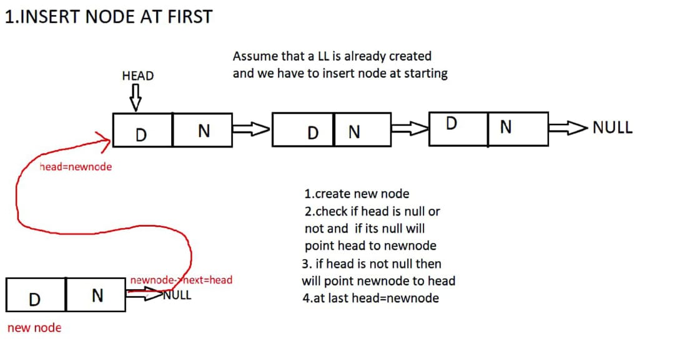
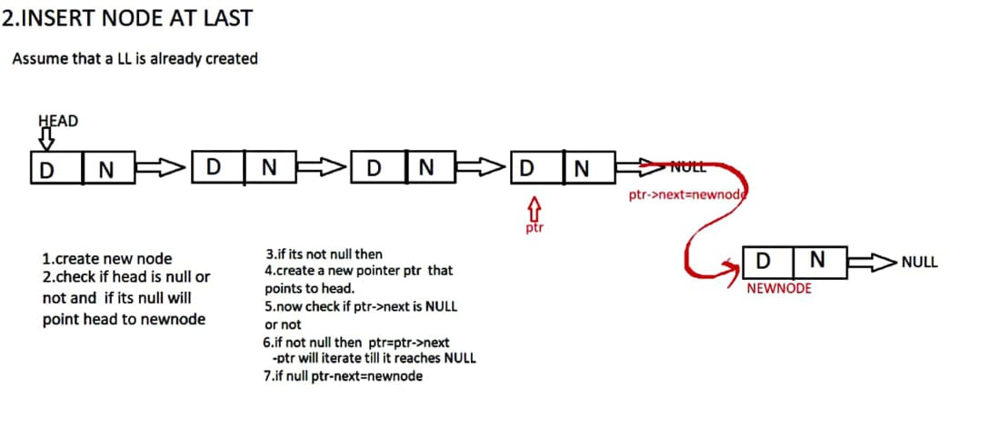
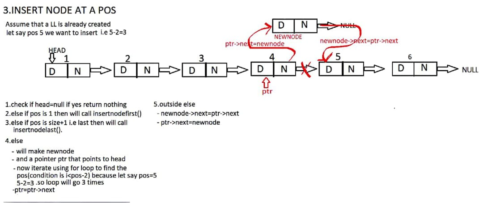
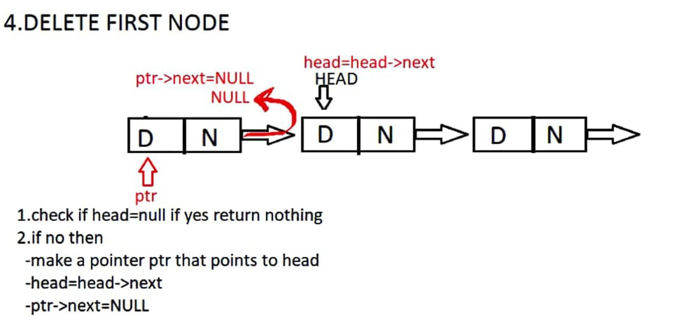
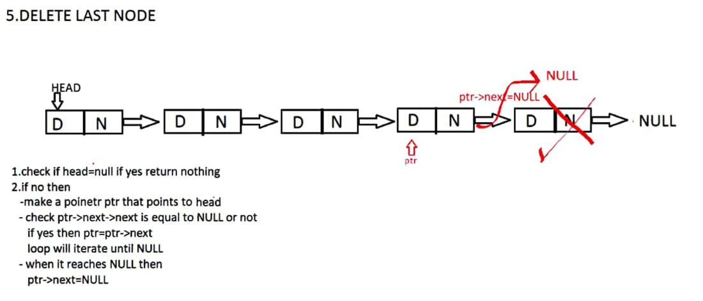
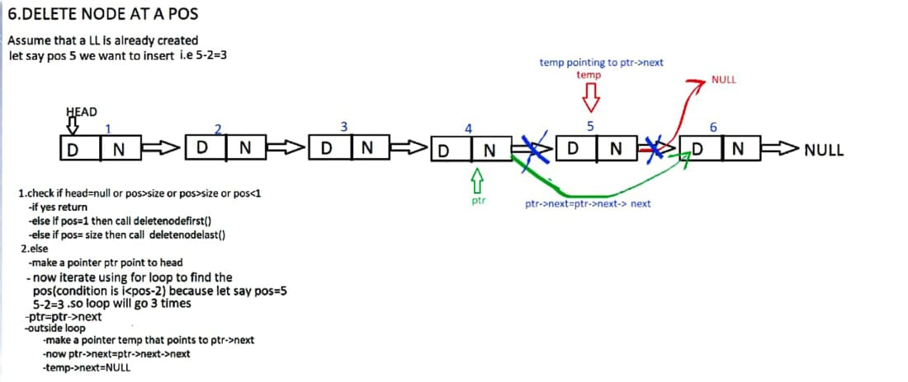
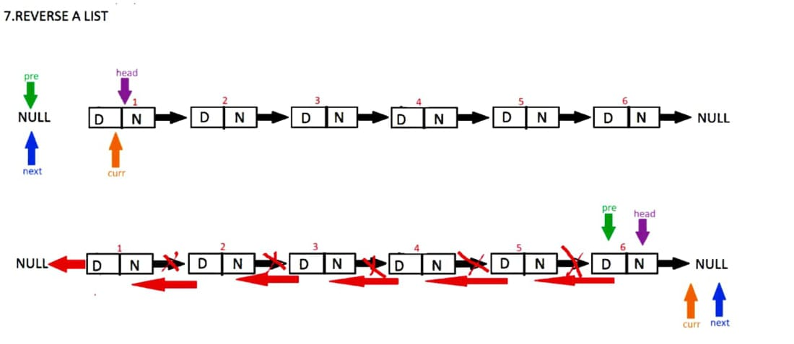
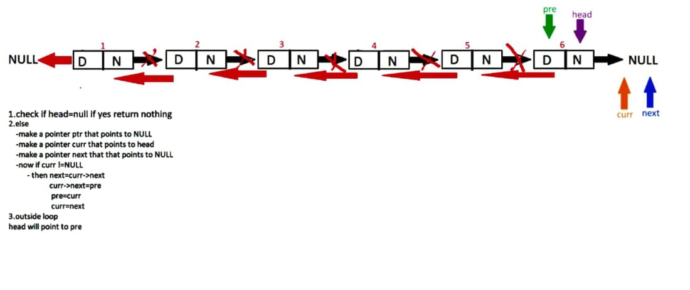

# Some Basic Operations on Singly-LinkedList:-

## 1.Insert Node at First
## 2.Insert Node at Last
## 3.Insert Node at any Position
## 4.Delete Node at First
## 5.Delete Node at Last
## 6.Delete Node at any Position
## 7.Reverse a LinkedList

 