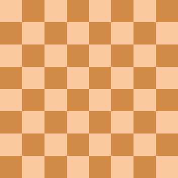

## [52. N-Queens-II](https://leetcode.com/problems/n-queens-ii/submissions/)-Approach 1
- #### In this Ques we will see NO 2 Queens attack each other and return count of queens.
```cpp
class Solution {
public:
    int totalNQueens(int n) {
         vector<vector<string>> ans; 
        vector<string> board(n);
        string s(n, '.'); 
        for(int i = 0;i<n;i++) {
            board[i] = s; 
        }
       return nQueen(0,board, ans, n); 
    }
    // Placing queen
    int nQueen(int col, vector<string> &board, vector<vector<string>> &ans, int n) {
        if(col == n) {
            ans.push_back(board); 
            return 1; 
        }
        int cnt=0;
        for(int row = 0;row<n;row++) {
            if(isSafe(row, col, board, n)) {
                board[row][col] = 'Q'; 
                cnt+=nQueen(col+1, board, ans, n); 
                board[row][col] = '.'; 
            }           
        }
        return cnt;
    }
   // checking if safe or not to place Q
    bool isSafe(int row, int col, vector<string> board, int n) { 
    //up digonal i--,j--
     for(int i=row,j=col;i>=0 && j>=0; i--,j--){
        if(board[i][j]=='Q') 
            return false;
    }
    // left i,j--
    for(int i=row,j=col;i>=0 && j>=0; j--){
         if(board[i][j]=='Q') 
             return false;
    }
    // down digonal i++, j-- 
    for(int i=row,j=col;i<n && j>=0; i++,j--){
        if(board[i][j]=='Q') 
            return false;
    }
     return true;
        
    }
};
```
## [52. N-Queens-II](https://leetcode.com/problems/n-queens-ii/submissions/)-Approach 2
```cpp
class Solution {
public:
    int totalNQueens(int n) {
         vector<vector<string>> ans; 
        vector<string> board(n);
        string s(n, '.'); 
        for(int i = 0;i<n;i++) {
            board[i] = s; 
        }
        // create hash for 3 directions.
        vector<int> leftRow(n, 0); 
        vector<int> upperDiagonal(2 * n - 1, 0); 
        vector<int> lowerDiagonal(2 * n - 1, 0); 
       return nQueen(0,board, ans, leftRow, upperDiagonal, lowerDiagonal, n); 
    }
    
    int nQueen(int col, vector<string> &board, vector<vector<string>> &ans, vector<int> &leftRow, vector<int> &upperDiagonal, vector<int> &lowerDiagonal, int n) {
        
        if(col ==n ) {
            ans.push_back(board); 
            return 1; 
        }
        int cnt=0;
        for(int row = 0;row<n;row++) {
            if(leftRow[row]==0 && lowerDiagonal[row + col] == 0 && upperDiagonal[n-1 + col - row] == 0) {
        
                board[row][col] = 'Q'; 
                leftRow[row] = 1; 
                lowerDiagonal[row+col] = 1; 
                upperDiagonal[n-1 + col - row] =1;
                cnt+=nQueen(col+1, board, ans, leftRow, upperDiagonal, lowerDiagonal, n); 
                board[row][col] = '.'; 
                leftRow[row] = 0; 
                lowerDiagonal[row+col] = 0; 
                upperDiagonal[n-1 + col - row] = 0;
            }
           
        }
        return cnt;
    }
};
```
<br>

